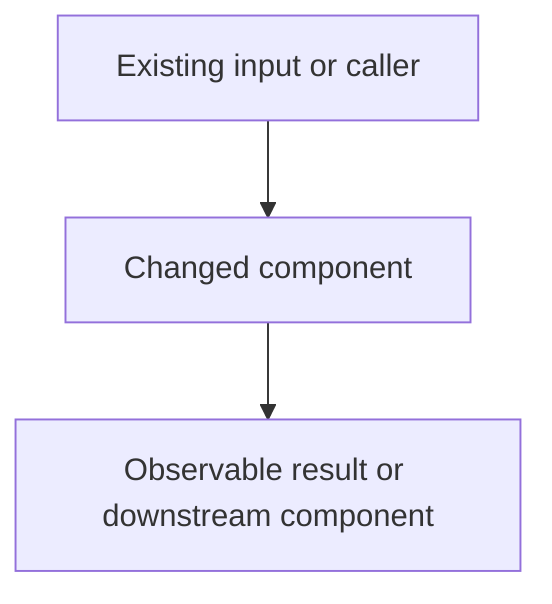

# Build Phased Plan

Create a dependency-aware plan that an implementation agent can execute task by task. Make every task independently verifiable and commit-sized. Model delivery as stacked pull requests (PRs): each phase is a new stack, and each task that changes the repository is one ordered PR in that phase's stack.

## Build the plan

1. Inspect the relevant repository, requirements, and local guidance before planning. Do not invent file paths, commands, or existing behavior.
2. State the objective, scope, assumptions, acceptance criteria, and known risks.
3. Choose a unique three-character plan reference, called `XXX`, from the plan title. Use uppercase ASCII letters or digits, with at least one letter. Record it near the top as `Plan reference: XXX`.
4. Divide the work into ordered phases. Give each phase a concrete outcome and completion criteria.
5. Break each phase into small, dependency-ordered tasks. Format every task as an unchecked Markdown checkbox.
6. Give every task a stable identifier in the form `#XXXPnTm`, where `XXX` is the plan reference, `n` is the phase number, and `m` is the task number within that phase. Start both numbers at 1 and never reuse an identifier.
7. Attach exactly one incremental commit message to every task. Format it as `#XXXPnTm: [imperative message]`. The prefix must exactly match the task identifier.
8. Assign every repository-changing task to a PR in the current phase's stack. Record the stack's base branch, parent PR, and bottom-to-top merge order.
9. Make the final task of every phase an independent AI-agent review gate. Do not place ordinary implementation tasks after it in that phase.
10. Check the plan for the validation rules below before returning it.

## Use stacked PRs

Every phase must be a new stack. A new stack has a distinct stack name or prefix and is created from the target branch updated with the approved result of the preceding phase. Do not append Phase 2 PRs to an open Phase 1 stack. Phase 1 starts from the repository's target branch; later phases start from the target branch after the preceding phase has been approved and integrated.

Within a phase:

- Create one PR per repository-changing task, in task/dependency order. Each PR contains exactly that task's incremental commit relative to its immediate parent PR.
- Set each PR's base to the immediately preceding PR in the same stack, except the bottom PR, which targets the phase stack base. Merge bottom-to-top only; never merge a child before its parent.
- Keep the stack linear and reviewable. If review remediation is needed, add a new remediation task and PR above the affected PR, then repeat the required review of the updated PR and stack.
- Treat the final review-gate task as the top PR when it records review evidence in the repository. It must not hide implementation changes.

Each phase in the plan must explicitly include:

```markdown
Stack: `<phase-stack-name>`
Base: `<target-branch or approved preceding-phase tip>`
PR order: `<bottom PR>` -> `<next PR>` -> `<top PR>`
```

## Require a technical PR description

Every PR, including remediation and review-record PRs, must have a clear description written for a technical reviewer. The description must explain the problem, the exact change, the files or modules affected, non-goals, dependencies/stack position, verification evidence, and known risks or follow-ups. It must include a readable Mermaid diagram that describes the changed control flow, data flow, module relationship, or state transition. Use a fenced `mermaid` block; the diagram must be specific to that PR and technically useful, not decorative.

For every PR task, include or generate a description with this shape:

````markdown
## What this PR does
<problem, intent, exact behavior or structure changed>

## Scope
- Changed: `<files/modules/artifacts>`
- Not changed: `<explicit non-goals>`

## Stack position
<stack name, PR number/order, base PR, and dependency rationale>

## Technical flow


## Verification
<commands and results, including focused and relevant broader checks>

## Risks and review notes
<invariants, compatibility concerns, and specific areas for review>
````

The plan must identify the concrete description content for each PR; do not use a generic diagram or a placeholder description in a delivered plan.

## Require a clean Opus review for every PR

Every PR must receive an independent review by Opus using the Claude CLI command form `claude -p "prompt" --model opus`. The review prompt must tell Opus to inspect the PR diff and evidence, load and apply the repository's review guidance, and use the right review skills for the code being changed. At minimum, load and name the repository's standards/spec review skill (`code-review` when available) plus every applicable language, framework, testing, security, performance, or database review skill. Record the exact skill names or paths used; do not substitute a generic “review the code” prompt for skill-guided review.

Use a prompt equivalent to this, adapted to the repository and PR:

```sh
claude -p "Act as an independent technical reviewer for PR <PR/task identifier>. Load and apply the repository's review guidance and these relevant review skills: <skill names or paths>. Inspect only the PR diff, its parent stack diff, the PR description, and the cited verification evidence. Check correctness, regressions, scope control, test adequacy, security/performance implications, and compliance with the stated contract. Report findings by severity with concrete file/line references. If there are no actionable findings, state CLEAN REVIEW explicitly." --model opus
```

The PR is not clean until Opus reports no unresolved actionable findings. Resolve every finding, rerun affected checks, update the PR description/evidence, and rerun the same review on the updated diff. Record the command, selected review skills, Opus output, findings/resolutions, checks rerun, commit/PR identity, and final `CLEAN REVIEW` verdict in the repository's established review artifact or, if none exists, in the plan's review record. A phase cannot complete until every PR in its stack is clean and the final phase-level review gate approves the complete stack.

## Write actionable tasks

Each task must identify:

- the intended change or review;
- the concrete files, modules, or artifact area when discoverable;
- the verification or acceptance evidence;
- the phase stack, PR position, parent PR, and technical PR description including a task-specific Mermaid diagram;
- the required Opus review command, applicable review skills, and durable clean-review evidence;
- its exact commit message.

Keep one logical change per task and one task per commit. Split a task when it spans unrelated concerns or cannot be reviewed safely as one commit. Include tests in the same task as the behavior they protect unless a separate test-only task has a clear dependency reason.

Use this shape:

```markdown
- [ ] #APIP1T1 Define the request validation contract in `src/api/validation.ts`.
  - Evidence: Focused validation tests pass for valid and invalid payloads.
  - PR: Phase 1 stack `api-validation-1`, bottom PR targeting `main`; include the technical description and task-specific Mermaid diagram required above.
  - Opus review: Run `claude -p "..." --model opus` with the repository's applicable review skills; record the output and final `CLEAN REVIEW` verdict.
  - Commit: `#APIP1T1: Define request validation contract`
```

## Require an independent review gate

End every phase with a task assigned to an AI agent that did not author that phase's changes. Require the reviewer to inspect the phase diff and verification evidence for correctness, regressions, scope control, test adequacy, and compliance with repository guidance.

The review task must:

- be the highest-numbered and final task in the phase;
- depend on all earlier tasks in that phase;
- name the required independent reviewer role, such as `code-reviewer` or `verifier`;
- require actionable findings to be resolved and relevant checks rerun before approval;
- require the complete phase stack to have a clean Opus review for every PR, using `claude -p "prompt" --model opus` with the applicable review skills;
- record the review outcome in a durable project artifact when the repository has an established location for it, or in the plan's review record otherwise;
- include a technical PR description with a task-specific Mermaid diagram if the review gate is represented by a PR;
- have its own task-matching incremental commit message;
- block phase completion until the independent agent approves the phase.

Use this shape:

```markdown
- [ ] #APIP1T3 Independent AI review gate (owner: a separate `code-reviewer` agent; depends on #APIP1T1 and #APIP1T2).
  - Review: Inspect the complete Phase 1 stack diff and evidence; report findings by severity. Confirm every PR in the stack has a clean Opus review using `claude -p "..." --model opus` and the applicable review skills.
  - Exit: Resolve all blocking findings, rerun affected checks, rerun Opus on updated PRs, and record approval before Phase 2 starts.
  - Evidence: Review record identifies the independent agent, stack/PR identities, Opus commands and skills, findings, resolutions, checks rerun, and final verdict.
  - Commit: `#APIP1T3: Record independent Phase 1 review`
```

If a review produces fixes, amend the review task's single commit only while it remains local and unshared. Otherwise add a new remediation task and commit in the same phase, then run a new final independent review task with the next task number. Never mark the phase complete with unresolved blocking findings.

## Use this output template

```markdown
# <Plan title>

Plan reference: XXX

## Objective

<Desired outcome>

## Scope

- In: <included work>
- Out: <excluded work>

## Acceptance criteria

- <observable success condition>

## Assumptions and risks

- <assumption or risk with mitigation>

## Phase 1 — <phase outcome>

Completion criteria: <observable phase exit condition, including independent approval>

Stack: `<phase-1-stack-name>`  
Base: `<target branch>`  
PR order: `<bottom PR>` -> `<next PR>` -> `<top PR>`

- [ ] #XXXP1T1 <task>
  - Evidence: <verification>
  - PR: <stack position, parent PR, technical description, and task-specific Mermaid diagram>
  - Opus review: <exact `claude -p "prompt" --model opus` review command, applicable skills, and clean-review record>
  - Commit: `#XXXP1T1: <imperative message>`
- [ ] #XXXP1T2 Independent AI review gate (owner: a separate `<reviewer-role>` agent; depends on #XXXP1T1).
  - Review: <complete stack review scope, including confirmation that every PR has a clean Opus review>
  - Exit: <finding-resolution, rerun, Opus, and approval requirements>
  - Evidence: <durable review record with stack/PR identities, commands, skills, findings, checks, and final verdict>
  - Commit: `#XXXP1T2: Record independent Phase 1 review`

## Phase 2 — <phase outcome>

Completion criteria: <observable phase exit condition, including independent approval>

Stack: `<phase-2-stack-name>`  
Base: `<target branch at the approved Phase 1 tip>`  
PR order: `<bottom PR>` -> `<next PR>` -> `<top PR>`

- [ ] #XXXP2T1 <task>
  - Evidence: <verification>
  - PR: <stack position, parent PR, technical description, and task-specific Mermaid diagram>
  - Opus review: <exact `claude -p "prompt" --model opus` review command, applicable skills, and clean-review record>
  - Commit: `#XXXP2T1: <imperative message>`
- [ ] #XXXP2T2 Independent AI review gate (owner: a separate `<reviewer-role>` agent; depends on #XXXP2T1).
  - Review: <complete stack review scope, including confirmation that every PR has a clean Opus review>
  - Exit: <finding-resolution, rerun, Opus, and approval requirements>
  - Evidence: <durable review record with stack/PR identities, commands, skills, findings, checks, and final verdict>
  - Commit: `#XXXP2T2: Record independent Phase 2 review`
```

Add or remove phases and tasks to fit the work. Do not emit placeholder text in the final plan.

## Validate before delivery

Confirm all of the following:

- Every task line begins with `- [ ]`.
- Every task identifier matches `#XXXPnTm` and uses the declared plan reference.
- Phase and task numbering is consecutive.
- Every task has exactly one `Commit:` entry whose prefix exactly matches its task identifier.
- Each task is small, ordered, actionable, and independently verifiable.
- Every phase declares a distinct new stack with a base and bottom-to-top PR order.
- Every repository-changing task maps to exactly one PR in its phase stack, with the immediate parent PR recorded.
- Every PR has a clear, task-specific technical description containing scope, verification, risks, and a fenced Mermaid diagram.
- Every PR has a recorded clean Opus review run as `claude -p "prompt" --model opus` with the applicable review skills named.
- The final task in every phase is an independent AI-agent review gate.
- Each review gate blocks the next phase until all PR findings are resolved, checks are rerun, every PR is clean under Opus review, and approval is recorded.
- Phase completion criteria include independent approval.
- No task depends on work scheduled in a later phase.

Return the plan in Markdown. Save it only when the user or repository workflow specifies a plan-file location; otherwise present it directly.
